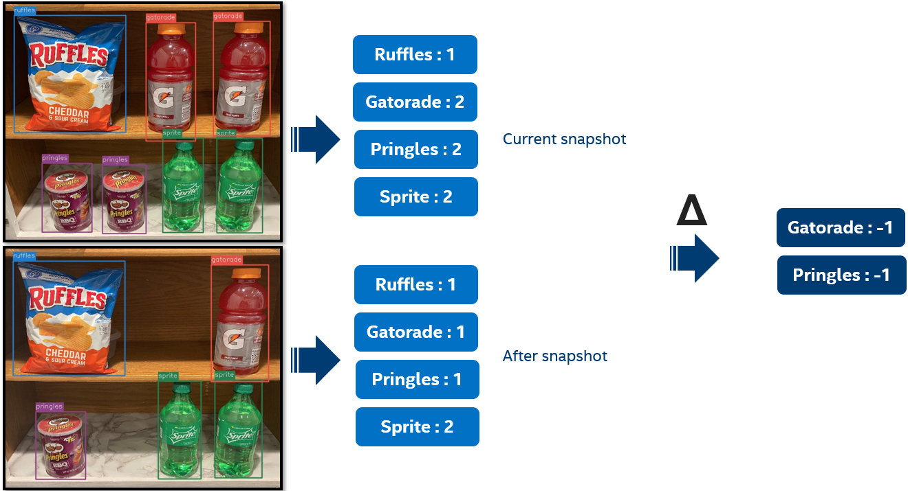

# Device Services

The **Automated Vending** reference implementation utilizes three device services that are used to communicate hardware event data to underlying EdgeX framework.

## List of device services

- Card reader – Handles the interface between an RFID card reader and EdgeX.
- Controller board – Handles the interface between Arduino firmware and EdgeX.
- CV Inference –  computer vision inference service using openVINO.

## Card reader

### Card reader description

The `ds-card-reader` device service is an EdgeX device service that allows a USB-based RFID card reader to grant access to the Automated Vending. At a high level, this device service is responsible for discovering a specific card reader device, watching for input from that device, parsing that input, and then forwarding the input into the EdgeX framework.

There are two different modes available to this device service:

1. **Physical Mode:** for use with a physical controller board device
1. **Virtual Mode:** used when simulating a physical controller board by using a RESTful endpoint

The EdgeX Core services are required for the `ds-card-reader` to publish the card ID into the EdgeX bus (zeroMQ). Without the EdgeX core services, this device service will not function.

### Card reader physical device functionality

The `ds-card-reader` service is much simpler than the `ds-controller-board` service, because it only requires mounting `/dev/input:/dev/input` at runtime. However, it still requires root privileges in the container at runtime so that it can interact directly with event/USB drivers.

### Card reader APIs

---

#### `PUT`: `http://localhost:48098/api/v3/device/name/card-reader/card-number`

The `PUT` API endpoint will push the badge ID (which is sent as part of the API request body) into the card reader device service. Once the card reader device service receives the badge ID, the badge ID will be pushed into the EdgeX bus for other application services to utilize.

```bash
curl -X PUT -H "Content-Type: application/json" -d '{"card-number":"0003278200"}' http://localhost:48098/api/v3/device/name/card-reader/card-number
```

Sample response:

```json
{
    "apiVersion": "v2",
    "statusCode": 200
}
```

---

#### `GET`: `http://localhost:48098/api/v3/device/name/card-reader/status`

The `GET` API endpoint returns data that is not meant to be consumed for any particular purpose. When triggering this endpoint, it will execute a function (in the Go source code) called `CardReaderStatus` that is used as an auto-remediation mechanism to attempt to "grab" the physical card reader HID device (via [`evdev`](https://en.wikipedia.org/wiki/Evdev)). If it succeeds in grabbing the underlying device, that means that the `ds-card-reader` device service has lost its hold on the card reader, and we need to restart the service. This endpoint is meant to be hit frequently.

```bash
curl -X GET http://localhost:48098/api/v3/device/name/card-reader/status
```

Sample response:

```json
{
    "apiVersion": "v2",
    "statusCode": 200
}
```

---

## Controller board

### Controller board description

The `ds-controller-board` device service is responsible for handling communication with a custom-built Arduino micro-controller board (or virtual board if you don't have physical hardware). It provides functionality for reading the lock status, door status, temperature, and humidity readings, while also sending commands to the controller board to unlock the mag-lock, and display output to the LCD.

There are two different modes available for this device service:

1. **Physical Mode:** for use with a physical controller board device
2. **Virtual Mode:** used when simulating a physical controller board by using a RESTful endpoint

### Controller board physical device functionality

When not running in simulated mode (i.e. a physical controller board device is plugged into your system), the `ds-controller-board` Docker container service requires `/dev/ttyACM0`, which is the typically the default serial port for an Arduino microcontroller.

This may change if you have multiple serial devices plugged in. Please ensure that `/dev/ttyACM0` maps to the appropriate serial device if you plan to run the `ds-controller-board` service with a physical device.

It is important to note that the `ds-controller-board` service _is_ capable of automatically finding a TTY port _aside_ from `/dev/ttyACM0`. It actually looks for the vendor and product ID (VID/PID) values specified in the service's configuration. The problems arise when we have to mount the TTY port via Docker:

- mounting `/dev:/dev` to the container at runtime solves the problem, but creates security risks and requires `--privileged=true` on the container, which is bad practice and can lead to security issues
- mounting `/dev/ttyACM0:/dev/ttyACM0` solves the problem, assuming there is only one serial device

Therefore, if you have multiple serial devices plugged into your system, please manually edit the `docker-compose.ac.yml` file to mount your `/dev/ttyACM_X_` appropriately. You may want to explore creating udev rules to enforce TTY consistency.

### Controller board APIs

---

#### `PUT`: `http://localhost:48097/api/v3/device/name/controller-board/lock1`

This `PUT` command will operate magnetic `lock1`. Depending on the numeric value of `lock1` (boolean `0/1`), the lock state will either be locked or unlocked.

Simple usage example:

```bash
curl -X PUT -H "Content-Type: application/json" -d '{"lock1":"0"}' http://localhost:59882/api/v3/device/name/controller-board/lock1
```

This will make the request directly to the device service itself instead of proxying through the EdgeX command API:

```bash
curl -X PUT -H "Content-Type: application/json" -d '{"lock1":"0"}' http://localhost:48097/api/v3/device/name/controller-board/lock1
```

---

#### `PUT`: `http://localhost:48097/api/v3/device/name/controller-board/lock2`

This `PUT` command will operate magnetic `lock2`. Depending on the numeric value of `lock2` (boolean `0/1`), the lock state will either be locked or unlocked.

!!! note
    Currently `lock2` has no purpose. During the initial architect/design phase of Automated Vending, there were two locks. This was later reduced to a single mag-lock.

Sample usage:

```bash
curl -X PUT -H "Content-Type: application/json" -d '{"lock2":"1"}' http://localhost:59882/api/v3/device/name/controller-board/lock2
```

This will make the request directly to the device service itself instead of proxying through the EdgeX command API:

```bash
curl -X PUT -H "Content-Type: application/json" -d '{"lock2":"1"}' http://localhost:48097/api/v3/device/name/controller-board/lock2
```

!!! success
    Response Status Code 200 OK.

!!! failure
    Response Status Code 400 Bad Request

---

#### `PUT`: `http://localhost:48097/api/v3/device/name/controller-board/displayRow0`

This `PUT` command will operate the display (LCD) and control the text to be put on the first line of the display.

Simple usage :

```bash
curl -X PUT -H "Content-Type: application/json" -d '{"displayRow0":"The Earth is round"}' http://localhost:59882/api/v3/device/name/controller-board/displayRow0
```

This will make the request directly to the device service itself instead of proxying through the EdgeX command API:

```bash
curl -X PUT -H "Content-Type: application/json" -d '{"displayRow0":"The Earth is round"}' http://localhost:48097/api/v3/device/name/controller-board/displayRow0
```

!!!info
    On the endpoint URL, Change displayRow**0** index to 1, 2, or 3 to display and control the text to be put on the second, third, and forth line accordingly.

!!! success
    Response Status Code 200 OK.

!!! failure
    Response Status Code 400 Bad Request

---

#### `PUT`: `http://localhost:48097/api/v3/device/name/controller-board/setTemperature`

This `PUT` command will emulate the temperature sensed by the controller board as a persistent value.

!!!info
    *setTemperature* is a float64. Any non-float64 value will be interpreted as '0.00' (do not have to specify decimal values).

Simple usage :

```bash
curl -X PUT -H "Content-Type: application/json" -d '{"setTemperature":"12.00"}' http://localhost:59882/api/v3/device/name/controller-board/setTemperature
```

This will make the request directly to the device service itself instead of proxying through the EdgeX command API:

```bash
curl -X PUT -H "Content-Type: application/json" -d '{"setTemperature":"12.00"}' http://localhost:48097/api/v3/device/name/controller-board/setTemperature
```

!!! success
    Response Status Code 200 OK.

!!! failure
    Response Status Code 400 Bad Request

---

#### `PUT`: `http://localhost:48097/api/v3/device/name/controller-board/setHumidity`

This `PUT` command will emulate the humidity sensed by the controller board as a persistent value.

!!!info
    *setHumidity* is an integer. Any non-integer value will be interpreted as '0'.

Simple usage example:

```bash
curl -X PUT -H "Content-Type: application/json" -d '{"setHumidity":"12"}' http://localhost:59882/api/v3/device/name/controller-board/setHumidity
```

This will make the request directly to the device service itself instead of proxying through the EdgeX command API:

```bash
curl -X PUT -H "Content-Type: application/json" -d '{"setHumidity":"12"}' http://localhost:48097/api/v3/device/name/controller-board/setHumidity
```

!!! success
    Response Status Code 200 OK.

!!! failure
    Response Status Code 400 Bad Request

---

#### `PUT`: `http://localhost:48097/api/v3/device/name/controller-board/setDoorClosed`

This `PUT` command will emulate the "door-closed" state sensed by the controller board as a persistent value.

!!!info
    *setDoorClosed* is a boolean-integer. Any non-boolean-integer value will be interpreted as '0' (and thus 'false'). Only '1' will result in 'true'.

Simple usage example:

```bash
curl -X PUT -H "Content-Type: application/json" -d '{"setDoorClosed":"0"}' http://localhost:59882/api/v3/device/name/controller-board/setDoorClosed
```

This will make the request directly to the device service itself instead of proxying through the EdgeX command API:

```bash
curl -X PUT -H "Content-Type: application/json" -d '{"setDoorClosed":"0"}' http://localhost:48097/api/v3/device/name/controller-board/setDoorClosed
```

!!! success
    Response Status Code 200 OK.

!!! failure
    Response Status Code 400 Bad Request

---

## CV inference

### CV inference description

The `ds-cv-inference` contains the following components:

- A golang implementation using openVINO inference engine and openVINO product detection model. This application uses preloaded images as an input to calculate inventory deltas. The images contain some products supported by the model and are used to simulate a purchase or stocking the cooler.
The openVINO product detection model is intended for demo purposes. For production environment, please replace it with your own model.
- The preloaded images are used in sequence to simulate a purchase using a circular queue to loop through them.
- An [EdgeX MQTT device service](https://github.com/edgexfoundry/device-mqtt-go) that converts MQTT messages into EdgeX event readings

The following picture illustrates the flow to calculate the inventory deltas between two preloaded images:

<p align="center">
    
</p>

The Automated Vending architecture uses three MQTT topics:

| Topic                       | Description                                                                                             |
| ----------------------------- | ------------------------------------------------------------------------------------------------ |
| Inference/CommandTopic                  | All events pushed from EdgeX's command API are fed into this topic. The [`as-vending`](https://github.com/intel-retail/automated-vending/tree/main/as-vending) and [`as-controller-board-status`](https://github.com/intel-retail/automated-vending/tree/main/as-controller-board-status) are two services that make requests to this API, typically for making door close/open and heartbeat events. |
| Inference/ResponseTopic  | The Automated Vending cv inference service will respond to published messages on the `Inference/CommandTopic` topic on the `Inference/ResponseTopic` topic. |
| Inference/DataTopic                | The cv inference service publishes delta SKUs on this topic, then the MQTT device service converts them into EdgeX event readings, and finally the [`as-vending`](https://github.com/intel-retail/automated-vending/tree/main/as-vending) service processes the event readings and pushes them to downstream services. |

### CV inference APIs

---

#### `GET`: `http://localhost:59982/api/v3/device/name/Inference-device/inferenceHeartbeat`

The `GET` call to the EdgeX MQTT device service's `inferenceHearbeat` command will act as a health-check for the Automated Vending cv inference service. It must return `200 OK` upon swiping an RFID card in order for the vending workflow to begin. If it does not, the [`as-vending`](https://github.com/intel-retail/automated-vending/tree/main/as-vending) service will enter maintenance mode.

Simple usage example:

Through EdgeX command API:

```bash
curl -X GET http://localhost:59882/api/v3/device/name/Inference-device/inferenceHeartbeat
```

To MQTT device service itself:

```bash
curl -X GET http://localhost:59982/api/v3/device/name/Inference-device/inferenceHeartbeat
```

Sample response, `200 OK`:

```json
{
    "device": "Inference-device",
    "origin": 1579637607912,
    "readings": [
        {
            "origin": 1579637607911,
            "device": "Inference-device",
            "name": "inferenceHeartbeat",
            "value": "inferencePong"
        }
    ]
}
```

---

#### `PUT`: `http://localhost:59982/api/v3/device/name/Inference-device/inferenceDoorStatus`

The `PUT` call to the EdgeX MQTT device service's `inferenceDoorStatus` command will cause the cv inference service to consume the message, and if the JSON `PUT` key `inferenceDoorStatus` has the string value `"true"`, an inference attempt will begin. The service will subsequently respond with a message containing the inventory delta (aka SKU delta).

Simple usage example:

Through EdgeX command API:

```bash
curl -X PUT -d '{"inferenceDoorStatus":"true"}' http://localhost:59882/api/v3/device/name/Inference-device/inferenceDoorStatus
```

To MQTT device service itself:

```bash
curl -X PUT -d '{"inferenceDoorStatus":"true"}' http://localhost:59982/api/v3/device/name/Inference-device/inferenceDoorStatus
```

!!! success
    Response Status Code 200 OK.

---
