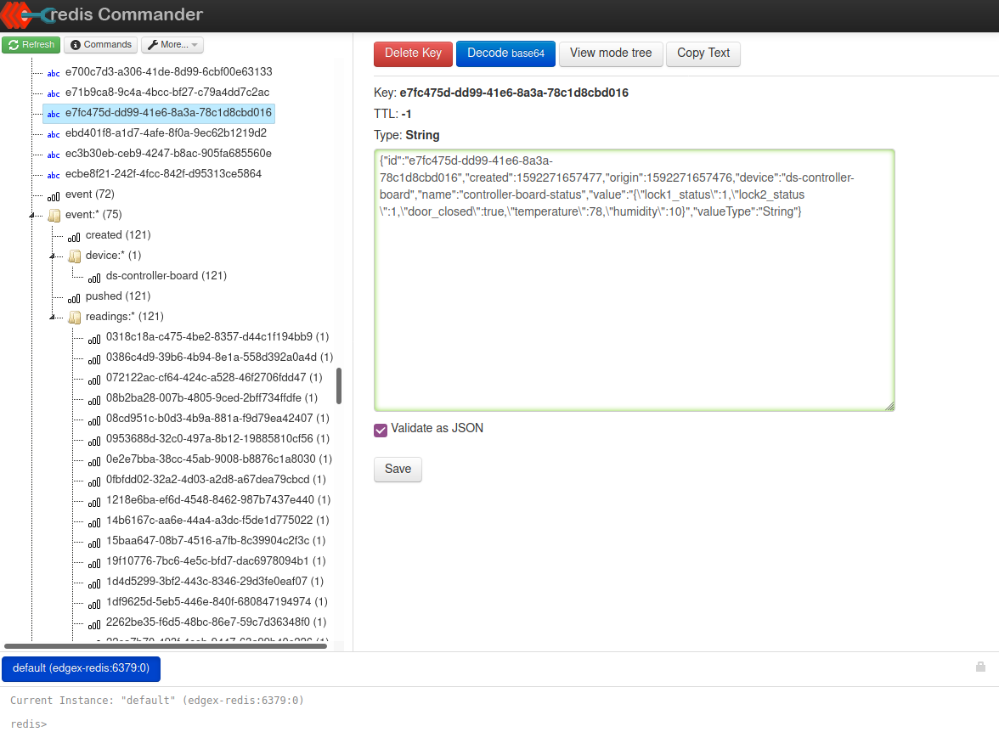
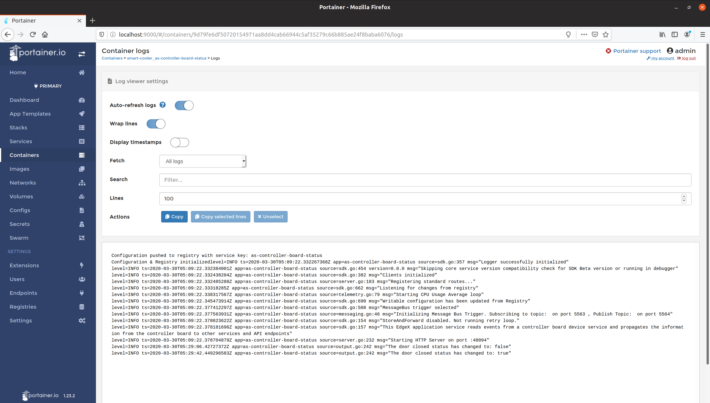

# Troubleshooting

The following guide will help walk you through the flow of data to address potential issues as they occur. This guide does not comprehensively cover all possible troubleshooting scenarios. It provides guidance on how to leverage a few essential tools to augment all troubleshooting efforts in general.

## Ensuring your device services receive data

All sensor data that is ingested in Automated Checkout flows through a device service as the first step. These device services are the first place we should check to ensure they are both running and ingesting data. One of the best ways to do to this is to leverage Portainer (included in EdgeX Releases).

!!!info
    *Portainer is a tool to help manage Docker containers. To learn more visit: [https://www.portainer.io/overview/](https://www.portainer.io/overview/)*

We have 3 device services of note in Automated Checkout:

- Controller board – Handles the interface between Arduino firmware and EdgeX.
- Card reader – Handles the interface between an RFID card reader and EdgeX.
- CV Inference –  computer vision inference service using openVINO.

We can type "ds" in the search bar on the Portainer web portal ([127.0.0.1:9000](http://127.0.0.1:9000)) and see all the device service containers that are in our stack (see image below). We can also see their current state which indicates if they are running or not. If a service is not running, or is in a "stopped" state, then this is likely the cause of data not flowing through.


However, if the state is "running", we can dig a little deeper by viewing the logs. Though, before we dig into the logs, it is important to call out that we will want to ensure that the logging level is set to "TRACE" for each service we intend to inspect.

This can be accomplished by doing the following:

- Navigate to Consul in a browser, which is located at [http://localhost:8500](http://localhost:8500/).
- Click `Key/Value` at the top navbar.
- Click `edgex` in the list.
- Depending on which service you want to inspect, choose either `devices`, `appservices`, or `core`.
  - For a device service, this would be `devices`.
  - For all application services, this would be `appservices`.
  - For all EdgeX core services, this would be `core`.
- Click `1.0`.
- Click on the service that you're interested in changing.
- Click `Writable`.
- Click `LogLevel`.
- Set the value in the text box to `TRACE`, it likely is set to `INFO` by default.
- Click the "Save" button.

After following the above steps, proceed to view the logs for the service, and observe that `level=TRACE` logs begin to appear.


## Ensuring EdgeX core services have received data

After ensuring that data is flowing properly to the device services, the next place to check would be EdgeX’s _"core data"_ service. You can follow the same steps as above to see if data is flowing and check the logs. However, using a tool such as Redis Commander or Redis Desktop Manager to inspect the database is the best way to ensure data has been properly processed by EdgeX's Core Data.

!!!info
    *Redis Commander is a tool to manage Redis databases: [https://github.com/joeferner/redis-commander](https://github.com/joeferner/redis-commander)*

    *Redis Desktop Manager is another tool to manage Redis databases: [https://redisdesktop.com/](https://redisdesktop.com/)*

Redis Commander can be run in Docker by simply executing the following shell command (you may need to change the name of the `automated-checkout_default` network):

```bash
docker run --rm --name redis-commander -d \
    -p 8081:8081 \
    --env REDIS_HOSTS=edgex-redis \
    --network automated-checkout_default \
    rediscommander/redis-commander:latest
```



The way EdgeX pushes data into Redis is as follows:

- Events, readings, addressables, and all other primitive data types in EdgeX are pushed as simple key-value pairs, with the key being a UUID, and the value typically being a JSON string
- Associations and other references between data is stored using a hierarchy of sorted sets, such as keys following the pattern `event:readings:<uuid>` with each value being a reference to the actual key that contains the actual underlying data

It is a good idea to check and make sure all the device names and values are what you expect them to be. It is often the case that a device name or reading name may not match what it is intended, and this could cause issues in your app service.

## Checking the controller board status application service

After ensuring data has made it to the database, the next place to check is the Controller Board Status App Service (`as-controller-board-status`). Similar to what we did in Step 1, let’s check Portainer for the status of this container to ensure it is running and lets also take a look at the logs. After ensuring the logging level is set to ‘TRACE’, we should see something akin to the following:



In the unlikely event that no data is flowing at all to the Controller Board status App Service, this would lead us to an issue with the ZMQ connection from the App Service to Core Data. Double checking the TOML file configuration where the hostname, port, and topic are specified would be a good place to start. You should also check that the App Service is on the same docker network and is accessible via the network.

Once connectivity issues have been resolved, the next step is to ensure that all filters (i.e. device names) are correct and match what is shown in the database from the previous step. If they do not match, then they will be filtered out and not be processed. One easy way to confirm that data is flowing is to remove filters entirely from the pipeline to see that there is data flowing.

For further troubleshooting, visit the landing page for the [EdgeX documentation](https://docs.edgexfoundry.org/2.2/) to get more help with any issues you may be encountering.
